# Gateway Ex Machina

Gateway Ex Machina (GatewayXM) is an extendable IOT gateway based on Eclipse Agile technologies, capable of collecting telemetry data from ModBus smart meters (TPU and RTU) and ESP8266/ESP32 sensor nodes arranged in a mesh topology and forwarding it to the Thingsboard IOT platform for storing, visualization and analysis. Both the gateway and the sensor nodes support remote updates (OTA).

The gateway consists of:

 - **Agile-stack** A set of tools by the [Agile-IOT](http://agile-iot.eu/) project for building robust modular IOT gateways, in a resin multi-container (modified to include Eclipse Kura and sensor node OTA support).
 - **Kura bundle** Responsible for forwarding data from ModBus devices and ESP8266 sensors to Thingsboard as telemetry.
 - **ESP8266/ESP32 firmware** Arduino firmware based on [ESP8266MQTTMesh](https://github.com/PhracturedBlue/ESP8266MQTTMesh) with OTA and MQTT support. A mesh network sensor node for collecting telemetry in areas with limited connectivity.


 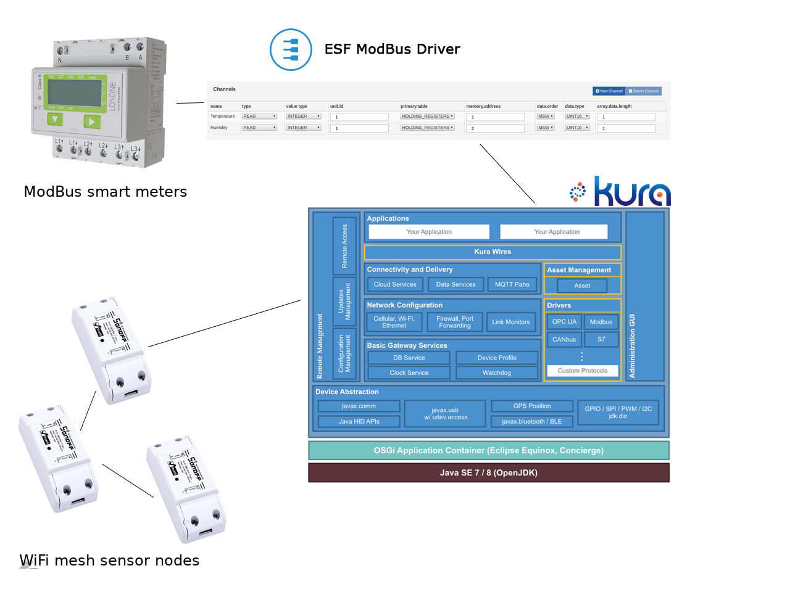

## Overview

### Thingsboard
Thingsboard (henceforth "TB") is an open-source platform for collecting, storing and visualizing data from IoT devices. It is a scalable out of the box solution that provides numerous interfaces to easily connect your devices, organize them in a multi-user, multi-tenant, multi-dashboard hierarchy and display collected data in graphical elements (widgets).

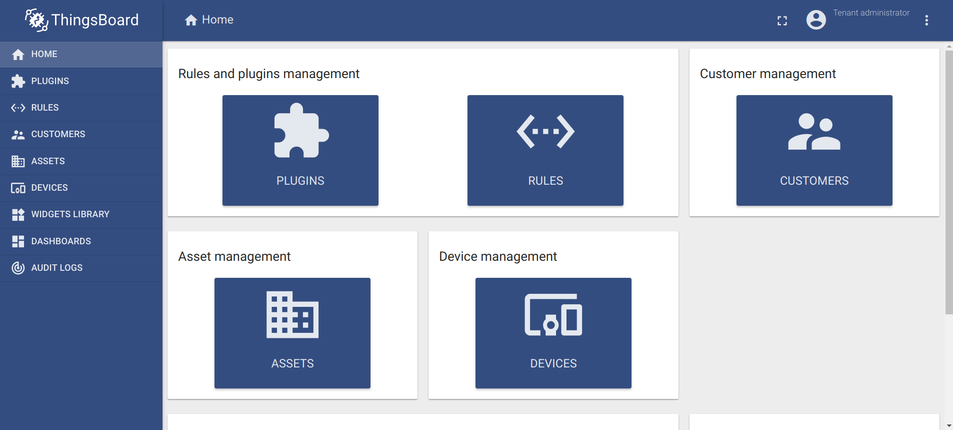

### Eclipse Kura
Eclipse Kura is a middleware modular gateway software for quick and easy deployment of IoT gateways, even on low power devices such as the Raspberry Pi. Kura is based on an OSGi implementation (Equinox) and provides an easy to use web interface for configuration and deployment of services. A module in Kura is a "bundle", which can act as a container for an IoT app and is fully managed by Kura. A bundle can use any of the services provided by Kura, along with a set of libraries for leveraging the various hardware interfaces provided by the host (usb, gpio etc.).

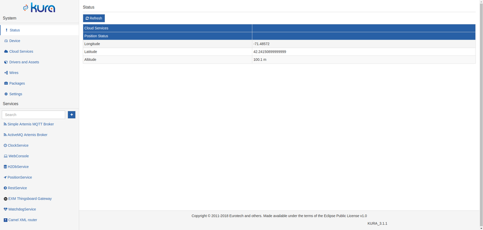

### Resin.io
ResinOS is an operating system based on Yocto Linux, optimized for running Docker containers on embedded devices. Resin.io is a platform which allows for managing fleets of ResinOS devices remotely,  all from an easy to use web interface. In the GatewayXM it is used both for remote updating the gateway's software and performing OTA updates on the ESP8266/ESP32 sensor nodes.

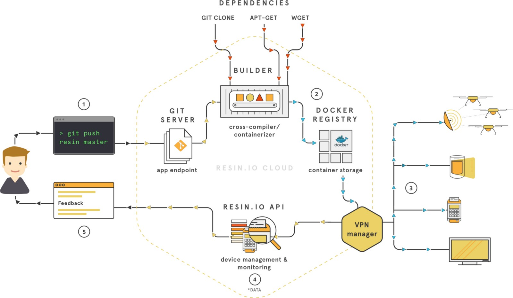

## Setting up the Gateway

### Creating a Resin.io account
To manage your gateway(s) you need a Resin.io account. A free account allows up to 10 free devices. In Resin, devices are created under an "Application" and all devices in this application run the same software and are updated at the same time.

To set up a new device, create an application in your resin.io dashboard and click "Add device", select "ethernet only", "production" edition and click download to download the ResinOS image which needs to be flashed to an SD card (use [etcher.io](https://etcher.io/)) and booted on your device. As soon as the device boots, it will appear in the resin.io dashboard as "Online".

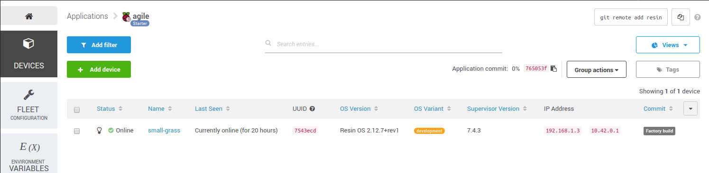

The Resin workflow is straightforward: a resin remote is added to the local git repository, changes are commited and pushed to it. The containers are built by resin's infrastructure on the cloud and deployed automatically to all the devices belonging to the application.

### Setting up a Resin hot spot
For the sensor nodes to be able to connect to the gateway, it must first be configured as an access point. With ResinOS it is as simple as creating a "resin-hotspot" file with the following content in /mnt/boot/system-connections and reboot:

```ini
[connection]
id=resin-hotspot
uuid=36060c57-aebd-4ccf-aba4-ef75121b5f77
type=wifi
autoconnect=false
interface-name=wlan0
permissions=
secondaries=

[wifi]
band=bg
mac-address-blacklist=
mac-address-randomization=0
mode=ap seen-bssids=
ssid=YOUR_SSID

[wifi-security]
group=
key-mgmt=wpa-psk
pairwise=
proto=
psk=YOUR_NETWORK_PASSWORD

[ipv4]
dns-search=
method=shared

[ipv6]
addr-gen-mode=stable-privacy
dns-search=
method=auto
```

It is recommended to [set a static ip as well](https://docs.resin.io/reference/resinOS/network/2.x/#setting-a-static-ip).

### Installing the Gateway software
Now that your device is up and running, the gateway software needs to be installed. The Gateway software consists of various elements (in Dockerized containers) that aid in building and extending the gateway functionality. One of them is Eclipse Kura, on which this implementation is  mainly based.

First, clone the [GatewayXM-Agile-Stack](https://github.com/exmgr/GatewayXM-Agile-Stack) repository with:

    git clone https://github.com/exmgr/GatewayXM-Agile-Stack.git

Switch to the "resin-multi" branch (soon to be merged with master):

    git checkout resin-multi

Add your Resin application's remote (you can copy paste this from the top right textbox on your Resin application dashboard):

    git remote add resin [your_resin_username]@git.resin.io:[you_resin_username]/[your_app_name].git

Now you can push it to resin which then will automatically build and deploy it to all the devices in your app:

    git push resin resin-multi:master

If the build is successful you will the resin unicorn:

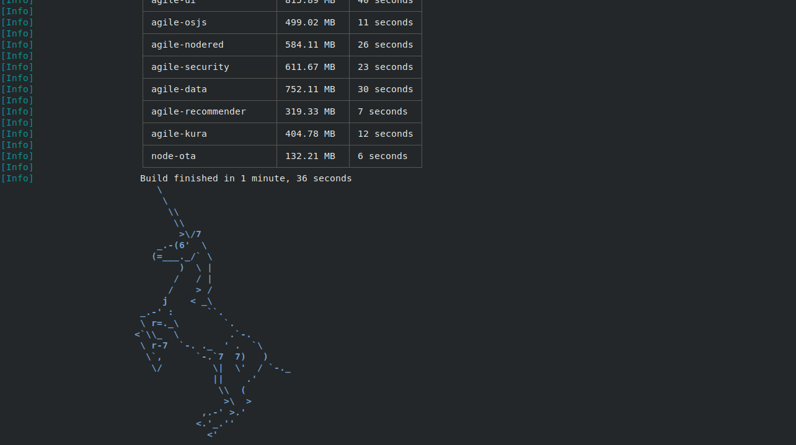

After everything is pushed to the resin repo and compiled, all the services appear in the device's dashboard and start downloading:

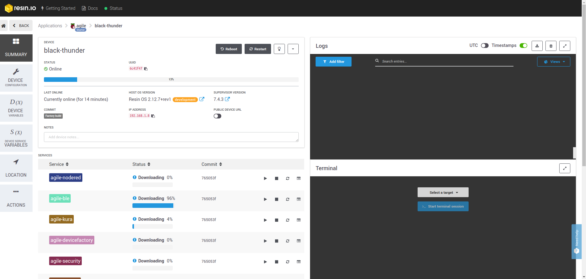

Kura's web interface can now be accessed at port [gateway_ip]:1234.

### Installing the Kura ModBus driver
In order for Kura to be able to access ModBus devices a ModBus driver must be installed. A free for testing purposes driver is available at the Eclipse Kura Marketplace: https://marketplace.eclipse.org/content/esf-modbus-driver . To install it, open the "packages" section in Kura web interface side by side with the Kura Marketplace page, drag the "install" button from the link above and drop it in packages, select "Install" at the prompt if asked. After a few seconds "com.eurotech.modbus.driver" will appear in the list.

### Installing the Kura bundle
The bundle can be installed through Kura’s web ui. Go to “Packages” -> “Install/Upgrade”, select the bundle’s .dp file (provided in /resources/dp/ in the [GatewayXM-Kura-Tb-Bundle](https://github.com/exmgr/GatewayXM-Kura-Tb-Bundle) repository) and click “Submit”. If all went well you should see it in the list of packages and in the list of installed configurable services on the bottom left part of the screen.
[picc]

## Gateway configuration
Now that everything is up and running, the gateway needs to be configured to prepare it for data acquisition.

### Setting up Thingsboard
In order for GatewayXM to be able to communicate with TB, a special "gateway" device needs to be created in the devices section of TB. Through this device the GatewayXM Kura bundle publishes all telemetry and creates all other TB devices which represent your real life ModBus meters or ESP8266/32 sensor nodes.
GatewayXM authorizes itself to the TB MQTT broker by the means of this gateway device's "access token" that can be obtained from TB in the following steps:

1. Log in to thingsboard
1. Go to devices and click "add new device" (+)
1. Type "GatewayXM" (or anything you like) in the name field, check "Is Gateway" and click "Add" to create the device.
1. Open the newly created device and click "Copy access token".

This access token will be used when configuring the GatewayXM Kura bundle.

### Configuring the GatewayXM Kura bundle
The GatewayXM Kura bundle can be configured from Kura's built in web-ui which is accessible at [gateway-ip]:1234. On the bottom left part of the screen, Kura lists all running configurable bundles.
Open "GatewayXM" and fill the form:

* Your Thingsboard installation URI, you can create an account at demo.thingsboard.io for testing. 
* Thingsboard MQTT broker port, 1883 by default.
* Gateway device access token: The token you copied in the previous step.
* MQTT client id: The id by which the gateway will be identified at the broker (can be anything).
* Poll interval: Interval at which the configured slaves are read.

Click apply to save.

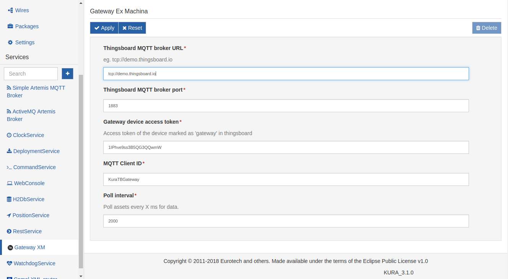

### Configuring Kura Artemis MQTT broker
Kura comes with it's own lightweight MQTT broker preinstalled as a bundle, to which the ESP8266/32 sensor nodes publish their telemetry and at the same time the GatewayXM bundle which is subscribed to this broker, transforms it and publishes it to Thingsboard.
To configure Artemis MQTT click "Simple Artemis MQTT broker" under services on the bottom left side and fill the form:

 - Set enabled to "true"
 - Set MQTT address to 0.0.0.0
 - Set access credentials (will be used by the sensor nodes to access the broker - can be left blank)

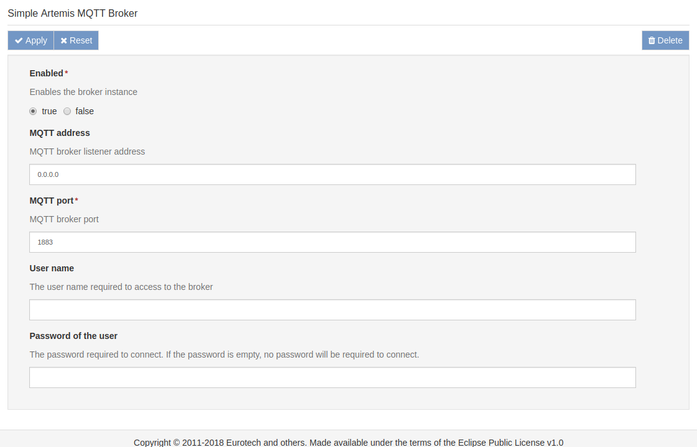

## Telemetry devices
### Modbus devices
With the ModBus driver installed in Kura, we can create an instance of this driver to which we will add our devices.
In Kura, devices are represented by "Assets" and each object of an Asset (coils, discrete inputs, input registers, holding registers) are represented by "Channels".

To set up a modbus device:

Go to "Drivers and Assets" and click "New Driver". Under "driver factory" select the driver you just installed, enter a name under "driver name" and click "Apply". Clicking the newly created instance opens its configuration page below. Since the ModBus configuration is on per-instance basis, you can connect both ModBus-TCP/UDP and ModBus-RTU devices at the same time.

Now let's add your first device. Click "New Assets", enter a name, select the newly created driver instance and click "Apply". The new device appears in the list. Select the device by clicking it, to reveal the "Channels" list. Click "New Channel" to add a new channel, enter a name and click "Add". After adding all your channels and configuring them, click "Apply" themo save. If the configuration is correct and the devices are connected properly, by clicking the "Data" tab Kura reads all the configured channels on this asset and displays their current values.


### ESP8266/32 sensor nodes
The sensor nodes are based on the [ESP8266MQTTMesh](https://github.com/PhracturedBlue/ESP8266MQTTMesh) library. Sensor nodes automatically form a mesh network when no WiFi access point is available within range, this allows them to operate even when WiFi signal coverage is low.
As soon as a sensor node is powered up, it tries to connect to the GatewayXM access point with the provided credentials. If it fails, it scans for nearby sensor-nodes belonging to the same mesh network (i.e. with the same mesh credentials) and joins it. As long as one of the sensor nodes in the mesh is within the access point's signal range, the sensor network can operate and transmit telemetry.
In addition sensor node firmware can be updated through OTA.

The sensor node firmware code be found in the [GatewayXM-Sensor-Node](https://github.com/exmgr/GatewayXM-Sensor-Node)  repository. 

To configure the firmware, open main.cpp and edit the constants:

 - FW_ID - Firmware id, used for OTA to distinguish between devices and update only the devices that have a certain FW_ID.
 - MESH_PASS - Mesh network password, all nodes in a mesh must have the same password.
 - MQTT_BROKER - GatewayXM's ip address (Artemis MQTT)
 - MQTT_PORT - MQTT broker port
 - NETWORKS - WiFi credentials of GatewayXM access point

The sample code in the repository reads temperature and humidity from a DHT21 sensor every few seconds. For demo purposes, you can set DUMMY_VALUES to 1 to publish dummy values.

After compiling and flashing, the node is ready to join the network and send telemetry.

## Displaying the data in thingboard
Assuming that the bundle and all the devices are configured properly, the devices appear automatically in thingsboard (under “Devices”) right after the first time data is read from their channels and submitted to TB.

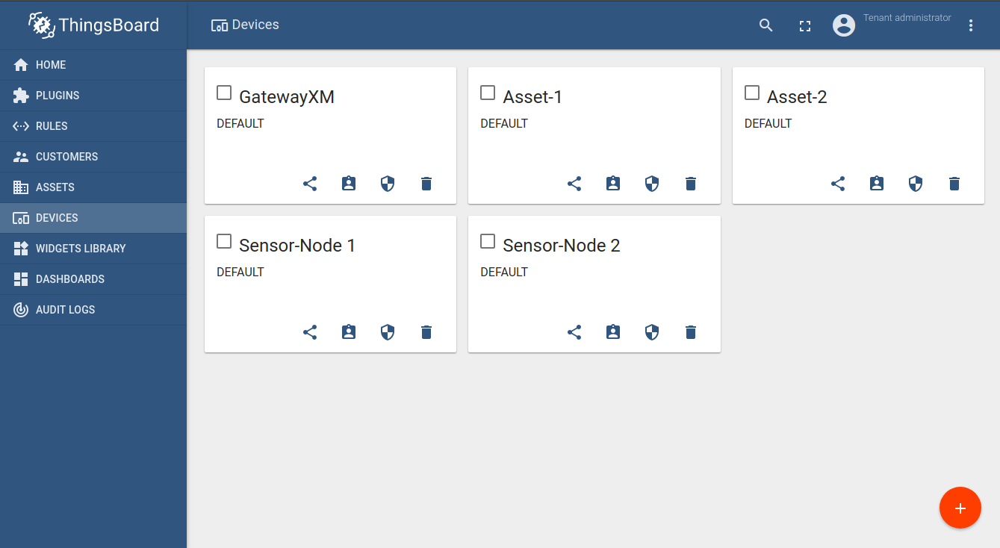

Now we can add a graphical element (widget) which will visualize received data. In TB, widgets are organized in dashboards.

1. To create a dashboard, go to “Dashboard” and click (+) “Add new Dashboard” -> “Create new Dashboard”, fill the form and click “Add”.
2. Now go to “Devices”, select a device and click open the “latest telemetry” tab. Here you can see the data received by this device. If the list is empty, either your device hasn’t sent any data yet, or the configuration in the previous steps was done incorrectly.
3. Check all the metrics you want to appear in the widget and click “Show on widget”. In the dropdown that appears, you can see all the types of widgets that TB supports. Select “Charts” and browse to the “Timeseries - Flot” widget (you can browse through available widgets by clicking the little arrows on the left and right side of the popup) and click “Add to dashboard”. 

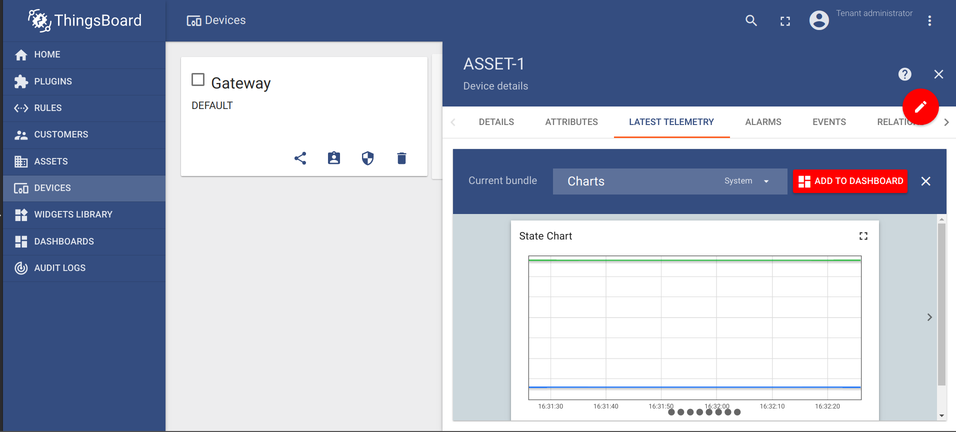

Finally, select the target dashboard, check “open dashboard” to view the dashboard immediately after adding it, and click “Add”.

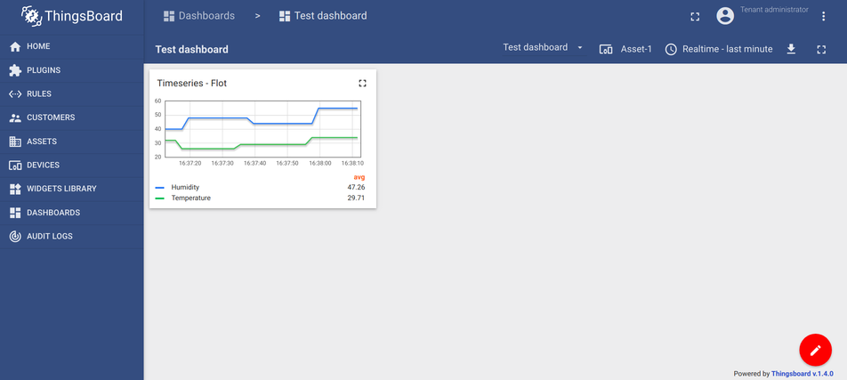

## GatewayXM software updates and OTA
### Gateway
Since GatewayXM is based on resin.io containers, the usual [resin workflow](https://resin.io/how-it-works/) applies: after performing any changes, they are commited and pushed to resin, where the containers are built and pushed automatically to all the gateway devices belonging to the same application.

### ESP8266/ESP32 sensor node OTA
To perform OTA updates on the sensor nodes, the firmware binary is pushed via resin.io to the gateway, which in turn forwards it to the meshed sensor nodes. After receiving the full file, they are updated, restart and rejoin the mesh network.

To push a new firmware, place the firmware.bin file in the GatewayXM-Agile-Stack/node-ota dir. To configure the update, edit the ENV vars in the Dockerfile:

 - FW_FILE - The name of the fw binary to be pushed
 - FW_ID - The fw_id of the sensor nodes to be updated. Only the nodes that match this id will receive the new firmware.

In GatewayXM-Agile-Stack/ run:

    git commit -m "new fw version"
    git push resin resin-multi:master


## Implementation Details

Kura provides all the libraries and interfaces you need to communicate with other services and the host hardware. As this is an OSGi environment, its a highly modular system that offers its functionality to be used by the developer through various services, while at the same time the inner workings are completely abstracted away.
Such abstraction examples are among others the Drivers, Assets and Channels used in this bundle. The developer need not be aware of the details that make them tick, Kura gives you only what you need to know and hides everything else. This results in a stable system in which components are interoperable and can be started, stopped or removed without affecting its function.
As an example, the ModBus driver installed in the previous steps can be easily exchanged with a different driver (eg. an OPC UA driver) and the components that make use of the driver (eg. Assets)  will keep functioning correctly as its integration to the overall system is completely transparent to the other components.

For Kura to provide the application an interface to a service, the app must request it by including a reference in the component definition xml file and at the same time define bind and unbind functions which will be called by Kura when it’s ready to provide it. In the Kura Thingsboard Gateway bundle we make use of the AssetService to load all the assets added by the user:

Component definition xml:
```xml
	<reference name="AssetService"
          policy="static"
          bind="setAssetService"       
          unbind="unsetAssetService"       
          cardinality="1..1" 
          interface="org.eclipse.kura.asset.AssetService"/>

```

The main class:
```java
public class MyBundle
{

    private static AssetService m_assetService;

    ...

    /** Called by Kura to set the AssetService when loading the bundle*/
    public void setAssetService(AssetService assetService)
    {
        m_assetService = assetService;
    }

    /** Called by Kura to unset the AssetService when unloadng the bundle */
    public void unsetAssetService(AssetService assetService)
    {
        m_assetService = null;
    }
}

```

When Kura loads our bundle, it will provide it with an AssetService object through the setAssetService function as we requested in the component xml file. This object gives us the means to load all available Assets and make read requests on their Channels as demonstrated below:


```java
// Iterate through all loaded assets
for (Asset asset : m_assetService.listAssets())
{
    try
    {
        // Make a read request on all the channels belonging to the asset
        List<ChannelRecord> channelRecords = asset.readAllChannels();

        // Iterate through the data read from each channel
        for (ChannelRecord rec : channelRecords)
        {

            System.out.println("Read: " + rec.getValue().getValue() + " from Channel: " + rec.getChannelName());

        }
    }
    catch (KuraException e)
    {
        AgileGateway.log("Error while reading channels" + e.getMessage());
    }
}
```

As evidenced by this code, we didn’t need to make any driver specific calls, or implement any protocols. All is done through generic API calls on simple interfaces while all the low level details are hidden away. This ensures that this code will work with any protocol compatible with the Assets service, since it is all completely transparent to the developer.

The latest (at the time of writing) version of the Kura API can be found here: http://download.eclipse.org/kura/docs/api/3.1.1/apidocs/